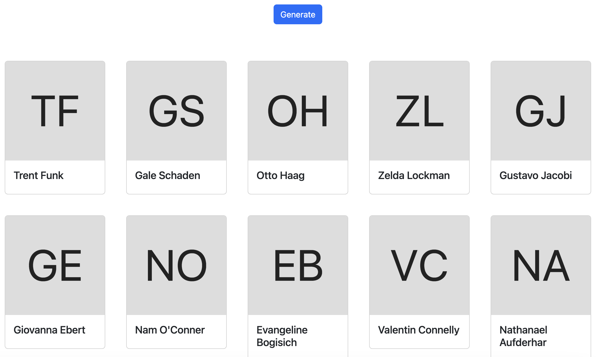
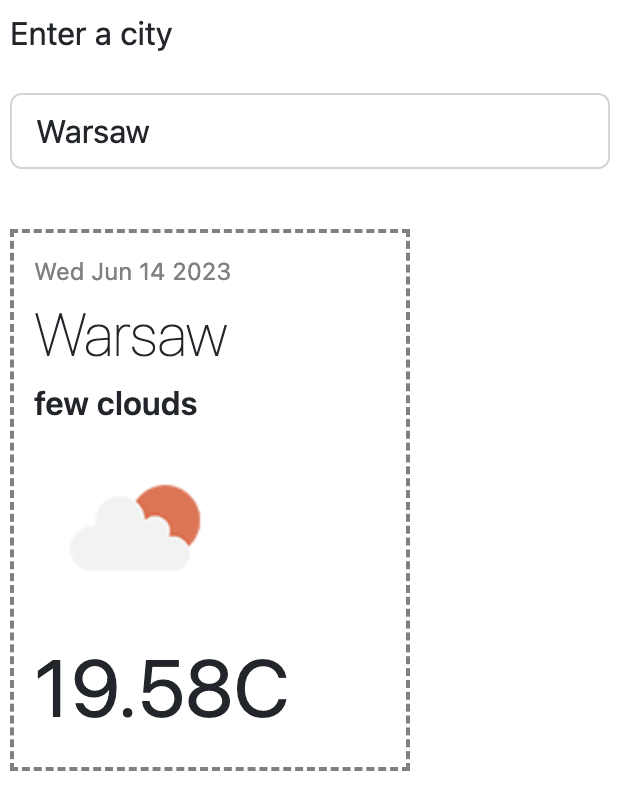

# Zadanie
## Opis
Napisz aplikację, która wyświetla informacje o nazwie użytkowników. Imię oraz nazwisko pobierane są z serwisu `https://random-data-api.com/`a avatar z `http://ui-avatars.com/`

Skorzystaj z `fetch`

<br>

## Przykładowy output



## Podpowiedź
Do zbudowania kafelków możesz użyć poniższego kodu:
```html
<div> 
    `<div class="card" style="width: 12rem;">
        
        <div class="card-body">
        <h5 class="card-title">${firstName} ${lastName}</h5>
        </div>
    </div>
</div>
```

<br>

# Zadanie
## Opis
Na podstawie poprzedniego zadania, wyciągnij liczbę użytkowników do pliku konfiguracyjnego

<br>

# Zadanie
## Opis
Usuń `fetch` i zastąp go biblioteką `axios`

<br>

# Zadanie
## Opis
Użytkownik w polu tekstowym podaje miasto. Aplikacja wyświetla pogodę po wciśnięciu guzika `Enter`

Skorzystaj z serwisu `https://openweathermap.org`



