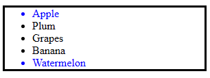

# Zadanie
## Opis
Zaimplementuj skrypt, który doda obramowanie wokół listy a pierwszemu i ostatniemu elementowi przypisze kolor niebieski. Mozesz skorzystac z podpowiedzi poniżej:

```javascript
/*...*/=document.getElementById('fruit-list');
ulEl.style.border = '3px solid black';
watermelonEl = ulEl.lastElementChild;
watermelonEl.style.color = 'blue';
```
A oto kod strony:
```html
<html>
    <body>
        <div id='container'>
            <ul id='fruit-list'>
                <li id='apple'>Apple</li>
                <li id='plum'>PLum</li>
                <li id='grapes'>Grapes</li>
                <li id='banana'>Banana</li>
                <li id='watermelon'>Watermelon</li>
            </ul>
        </div>
    </body>
    <script>
        //...
    </script>
</html>
```

## Oczekiwany efekt



<br>

# Zadanie
## Opis
Na podstawie kodu HTML z zadania pierwszego: 
- usuń pierwszy i ostatni element z listy
- usuń wszystkie elementy za wyjątkiem pierwszego i ostatniego

<br>

# Zadanie
## Opis
Na podstawie kodu HTML wybierz te gettery, które poprawnie wybierają elementy listy `fruitlist`

- `fruitList.getElementByTagName(”li”);`
- `document.getElementByTagName(”li”);`
- `container.getElementByTagName(”li”);`
- `fruitList.getElementByClassName(”fruit-list__item”);`
- `document.getElementByClassName(”fruit-list__item”);`
- `container.getElementByClassName(”fruit-list__item”);`

Kod strony:
```html
<html>
    <body>
        <!-- ... -->
        <div id='container'>
            <ul id='fruit-list'>
                <li class='fruit-list__item' id='apple'>Apple</li>
                <li class='fruit-list__item' id='plum'>PLum</li>
                <li class='fruit-list__item' id='grapes'>Grapes</li>
                <li class='fruit-list__item' id='banana'>Banana</li>
                <li class='fruit-list__item' id='watermelon'>Watermelon</li>
            </ul>
            <!-- ... -->
        </div>
        <!-- ... -->
    </body>
    <script>
        const container = document.getElementById('container');
        const fruitList = document.getElementById('fruit-list');
    </script>
</html>
```

<br>

# Zadanie
## Opis
Celem tego zadania jest zrozumienie co to znaczy `live collection`.

Wyciągnij elementy listy (patrz kod HTML z poprzedniego zadania) używając `querySelectorAll` oraz `getElementsByTagName`. Napisz funkcję `printContent`, która wyświetli ich zawartość (nazwy owoców).

Usuń śliwkę z poziomu `Developer tools`. Ewentualnie możesz posłużyć się:
```javascript
document.getElementById('plum').remove();
```
Uruchom `printContent` by wyświetlić elementy kolekcji. Jakie różnice zauważasz ?

<br>


# Zadanie
## Opis
Napisz skrypt, który dynamicznie doda listę owoców do strony

```html
<html>
    <body>
    <div id='container'></div>
    <script>
        //...
    </script>
    </body>
</html>
```

## Oczekiwany wynik
```html
<html>
    <body>
    <div id='container'>
        <ul>
            <li class='fruit-item'>Apple</li>
            <li class='fruit-item'>Plum</li>
            <li class='fruit-item'>Grapes</li>
            <li class='fruit-item'>Banana</li>
            <li class='fruit-item'>Watermelon</li>
        </ul>
    </div>
    <script>
        //...
    </script>
    </body>
</html>
```

## Podpowiedzi
```javascript
const li = document.createElement('li');

li.classList.add('fruit-item');
li.textContent = fruitName;

ul.appendChild(li);

container.appendChild(ul);

container.innerHtml = `...`
```

<br>

# Zadanie
## Opis
Mając dany kod `HTML` z listą owoców, zaimplementuj logikę usuwającą owoc gdy zostanie kliknięty


<br>

# Zadanie
## Opis

Zaimplementuj funkcję, która potrafi filtrować obrazki wg przesłanego parametru

```
function filter(alg) {
    //...
}

filter("grayscale");
filter("blur");
filter("contrast");
```