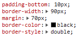
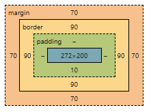

# Zadanie
## Opis

Zaimplementuj obiekt, który odpowiada poniższej regule CSS



<br>

# Zadanie
## Opis
Skorzystaj z `Object.assign` aby stworzyć klon obiektu
```javascript
const refObj = {
   name: 'Jan',
   surname: 'Kowalski',
   age: 65,
   occupation: 'worker',
};
```
Jak poradziłbyś sobie z utworzeniem kopii poniższego obiektu ?

```javascript
const refObj = {
   name: 'Jan',
   surname: 'Kowalski',
   age: 65,
   occupation: 'worker',
   children: ['Sandra', 'Damian', 'Maja'],
   address: {
      street: 'Poznanska',
      homeNumber: '34',
      city: 'Warsaw',
   },
};
```
<br>

# Zadanie
## Opis
Uzupełnij implementację funkcji

```javascript
let article = {
   journal: 'Math Journal',
   year: 2020,
   title: 'Linear function',
   getDescr() {
      //...
   },
   displayYearInConsole() {
      //...
   }
}

const descr = article.getDescr(); // 'Math Journal, Linear function, 2020'
```
Czy możemy użyć funkcji strzałkowej w Twoim rozwiązaniu ?


```javascript
let article = {
   //...
   getDescr: () => {
      //...
   },
   displayYearInConsole: () => {
      //...
   }
}
```
<br>

# Zadanie
## Opis
Stwórz obiekt opisujący przykładowy artykuł. Dodaj funkcje takie jak `getAuthor` oraz `getPageNo`. Ta druga zwraca string ”A book articleTitle has pageNo” a pierwsza:
”An author of an article articleTitle is articleAuthor”. Jakie inne funkcje byłyby przydatne ?

<br>

# Zadanie
## Opis

Zaimplementuj obiekt opisujący wymiary, obramowanie, 
margines i dopełnienie (patrz rysunek). Dodaj następujące funkcje jako właściwości:
   - `getWidth` zwraca czystą szerokość bez dopełnienia, obramowania i marginesu
   - `getTotalWidth` – zwraca powyższe wraz z obramowaniem, 
marginesem i dopełnieniem
   - `getHeight` oraz `getTotalHeight` mają działać w podobny sposób



<br>

# Zadanie
## Opis
Stwórz konstruktor (użyj `class`) umożliwiający tworzenie dowolnego obiektu `Box` z poprzedniego zadania

## Zastosowanie
```js
const block1 = new Block(272, 200, 0, 0, 0, 0, 90, 90, 90, 90, 70, 70, 70, 70);
const block2 = new Block(272, 2000, 10, 0, 0, 0, 90, 90, 190, 90, 700, 0, 170, 70);
const block3 = new Block(1272, 21000, 10, 0, 0, 0, 90, 90, 190, 90, 700, 0, 170, 70);
```

Czy wiesz jak uprościć przesyłanie parametrów do konstruktora ?

<br>

# Zadanie
## Opis
Zapoznaj się z konstruktorem `Ball`. Zaproponuj wyciągnięcie `showDescr` do prototypu aby oszczędzić pamięć

```javascript
function Ball(color, size) {
   this.color = color;
   this.size = size;
   this.type = 'regular',
   this.pressure = '4.5',
   this.showDescr = function() {
      console.log(`This is a ${this.type} ball\n` +
         `Pressure value: ${this.pressure}\n` +
         `Color: ${this.color}\n` + 
         `Size: ${this.size}\n`);
   };
}

const ball = new Ball('yellow', '5');
const ballDescr = ball.showDescr();

const anotherBall = new Ball('green', '6');
const anotherBallDescr = ball.showDescr();
```

# Zadanie
## Opis
Stwórz konstruktor, który tworzy prostopadłościan. Zaimplementuj funkcje `getArea`, `getPerimeter` i `getVolume`

<br>