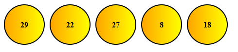
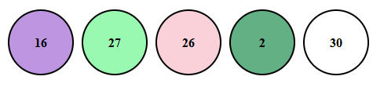

# Zadanie
## Opis
Zaimplementuj aplikację losującą 5 piłek z losowymi liczbami.

W późniejszym kroku rozszerz kod o dodanie `k` piłek z losowym kształtem. Wciśnięcie klawisza ma skutkować ponownym renderingiem

## DOM
+ createElement
+ querySelectorAll
+ appendChild
+ style.backgroundColor
+ classList.add

## JS
+ let/const/var/function
+ Math.round, Math.random
+ Array.length

## EVENTS
+ window.onkeydown

## HTML & CSS
+ flex
+ Orbitron
