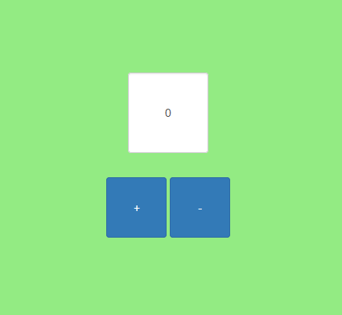
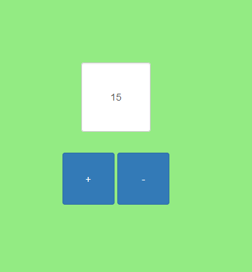

# Zadanie
## Opis
Zaimplementuj licznik wyświetlający liczbę, która może być zwiększona lub pomniejszona przez kliknięcie na przycisk

Po realizacji podstawowego zadania, rozwiń kod tak aby licznik malowany był czerwonym kolorem gdy wartość jest parzysta. Dodaj maksymalny próg. Zmień update licznika z 1 na 2

## DOM
+ getElementById
+ querySelector

## EVENTS
+ onclick
+ callbacks
+ addEventListener
+ onfocus
+ el.blur()

## JS
+ let/const/var
+ ? : 

## HTML
+ input readonly

## Dodatkowe
+ stylowanie (chrome)
+ Bootstrap
