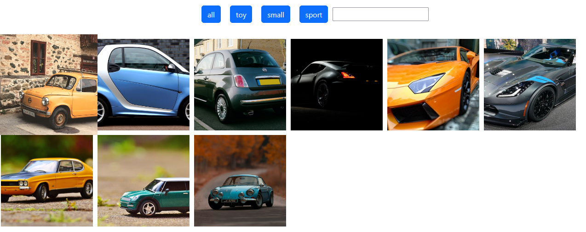
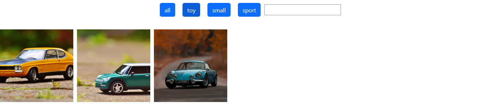
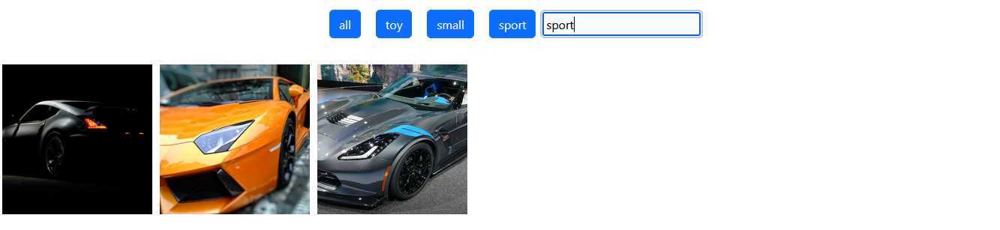
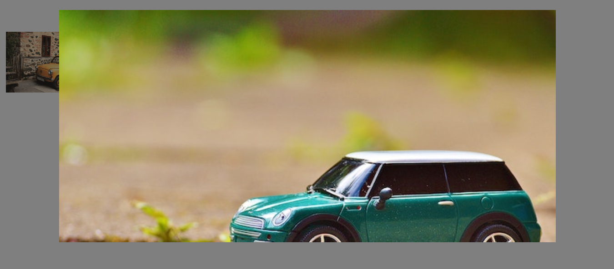

# Zadanie
## Opis
Napisz aplikację filtrującą auta w oparciu o ich typ. Filtr jest ustawiany przy użyciu przycisków, np: sportowe, małe, zabawki, itp. Wprowadź pole tekstowe jako alternatywny filtr

Informacje o lokalnie przechowywanych zdjęciach są pobierane z `config.json`. 

Kliknięcie obrazka powoduje jego powiększenie, które znika gdy użytkownik kliknie poza jego obszarem


## Przykładowy plik konfiguracyjny
``` javascript

const pics = [{
    src: "small_pexels-matthias-zomer-small_69020.jpg",
    type: "small",
}, {
    src: "small_pexels-mike-b-166680.jpg",
    type: "small",
}, {
    src: "small_pexels-mike-b-7459480.jpg",
    type: "small",
}, {
    src: "sport_pexels-albin-berlin-919073.jpg",
    type: "sport",
}, {
    src: "sport_pexels-pixabay-39501.jpg",
    type: "sport",
}, {
    src: "sport_pexels-pixabay-358070.jpg",
    type: "sport",
}, {
    src: "toy_pexels-pixabay-35619.jpg",
    type: "toy",
}, {
    src: "toy_pexels-pixabay-35967.jpg",
    type: "toy",
}, {
    src: "toy-pexels-alexgtacar-1592384.jpg",
    type: "toy",
}];

```






## HTML, CSS
+ flex
+ object-fit: cover
+ transform: scale(1.1)
+ transition: transform 0.5s
+ btn, btn-primary bootstrap
+ data-*

## DOM
+ getElementById, getElementsByTagName
+ classList.add, classList.remove
+ appendChild
+ addEventListener, keypress, click
+ dataset.type

## JS
+ for/if/function

## Debugging
+  Chrome
+  w VSC
