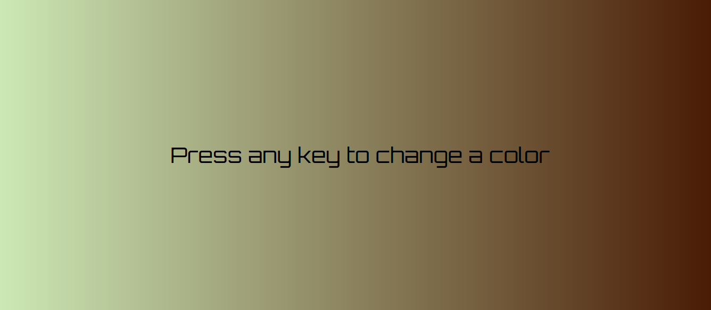
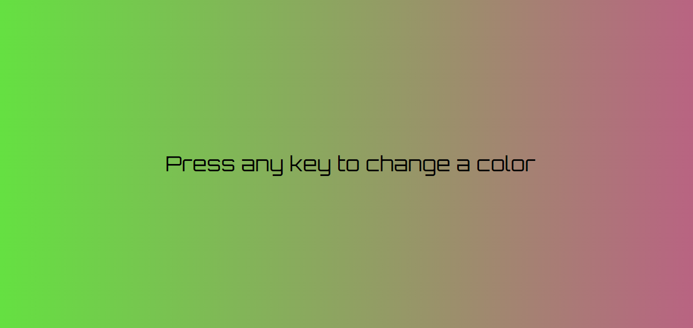

# Zadanie
## Opis
Zaimplementuj aplikację, która zmienia losowo kolor tła (liniowy gradient) po wciśnięciu klawisza

## DOM
+ createElement
+ insertBefore
+ style.backgroundImage

## JS
+ let/const/var
+ Math.round, Math.random
+ Array.length

## EVENTS
+ addEventListener
+ keydown

## HTML & CSS
+ flex
+ position: fixed
+ background-image: linear-gradient(to right, color1, color2)
+ Orbitron
